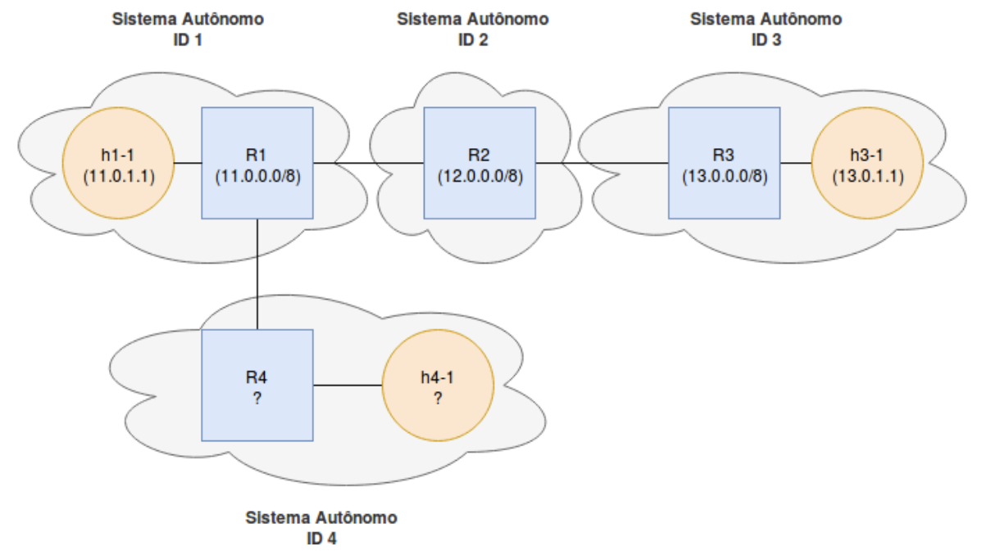
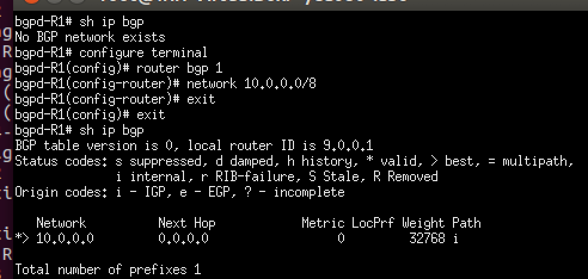
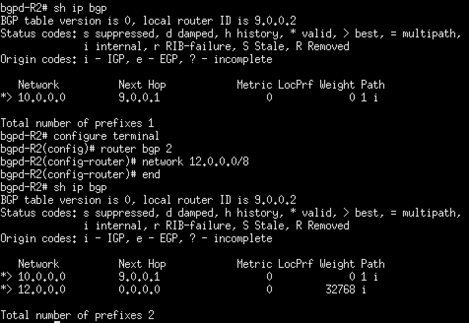
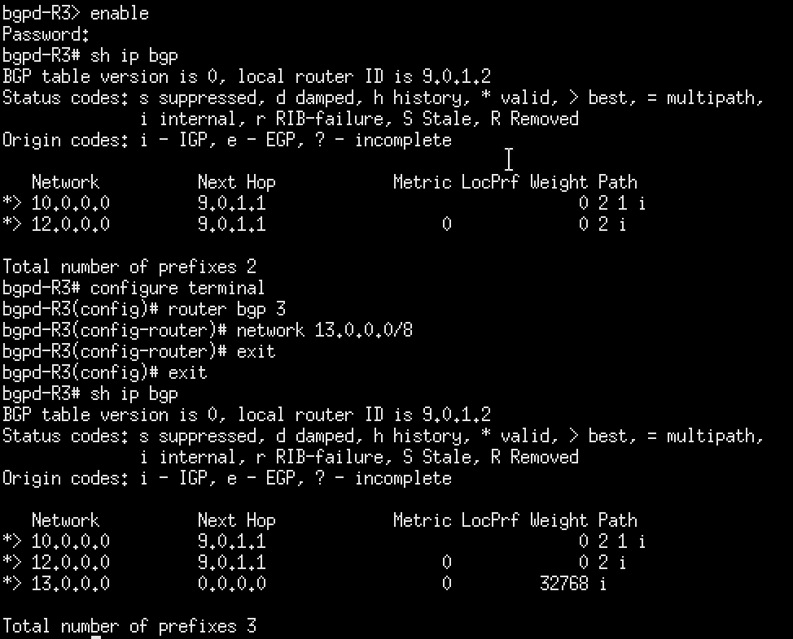
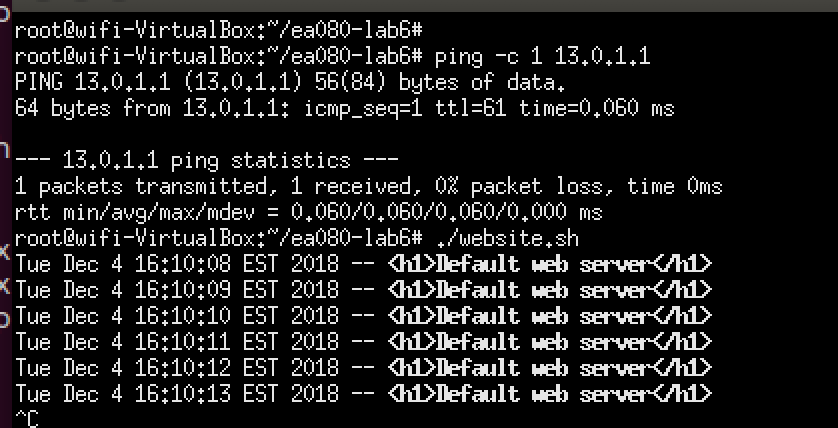
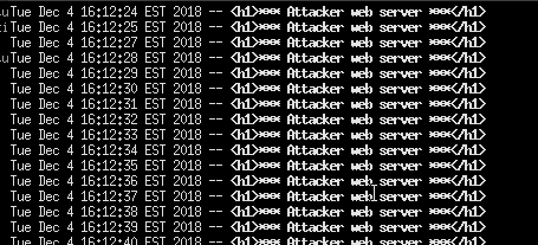
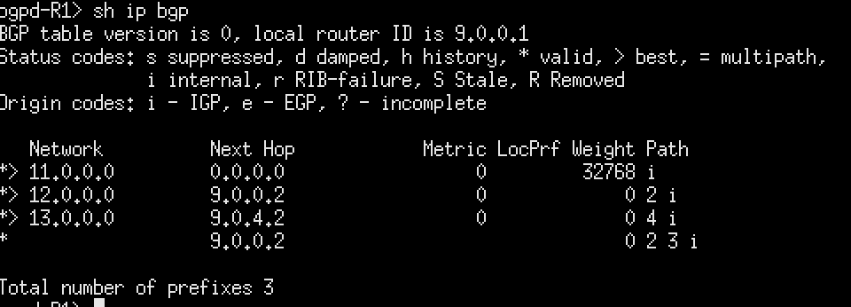
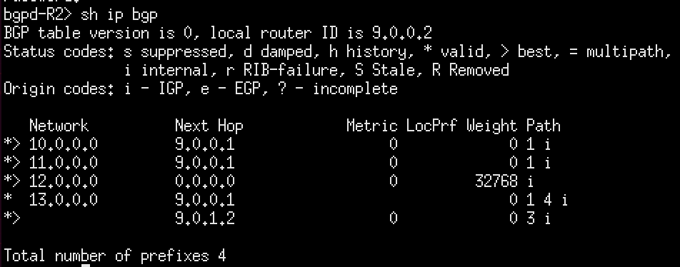

BGP Internet Routing
====================

BGP, or Border Gateway Protocol is one of the main protocols behind the popularization of the World Wide Web.
The BGP main purpose is to exchange information between routers between autonomous systems on the internet.

It's known as an Exterior protocol, which means it can aggregates between several subnetworks and is classified
by design as a Path Vector Protocol, which means it's based on neighbor routers transmitting their routing
tables every time a route has changed and the information is stored in the links rather than in every node.

To reproduce the experiments in this tutorial, you must install `quagga`, you can do this in debian-based
sytems with:

```
sudo apt-get install quagga
```


Basic BGP Routing
=================

For this example, we will be using the topology described in [example 6](../examples/example_6). We can
start it by running:

```
sudo python bgp.py
```

Note: unfortunately this example presented some issues when running inside an SSH session. We recommend
starting a graphical interface first with `xstart`.

The topology used in this experiment is described in the figure below.
We can quickly analyze some of their main aspects using `nodes` and `net`.




```
mininet> nodes
available nodes are:
R1 R2 R3 R4 c0 h1-1 h1-2 h1-3 h2-1 h2-2 h2-3 h3-1 h3-2 h3-3 h4-1 h4-2 h4-3
```

```
mininet> net
h1-1 h1-1-eth0:R1-eth1
h1-2 h1-2-eth0:R1-eth2
h1-3 h1-3-eth0:R1-eth3
h2-1 h2-1-eth0:R2-eth1
h2-2 h2-2-eth0:R2-eth2
h2-3 h2-3-eth0:R2-eth3
h3-1 h3-1-eth0:R3-eth1
h3-2 h3-2-eth0:R3-eth2
h3-3 h3-3-eth0:R3-eth3
h4-1 h4-1-eth0:R4-eth1
h4-2 h4-2-eth0:R4-eth2
h4-3 h4-3-eth0:R4-eth3
R1 R1-eth1:h1-1-eth0 R1-eth2:h1-2-eth0 R1-eth3:h1-3-eth0 R1-eth4:R2-eth4 R1-eth5:R4-eth4
R2 R2-eth1:h2-1-eth0 R2-eth2:h2-2-eth0 R2-eth3:h2-3-eth0 R2-eth4:R1-eth4 R2-eth5:R3-eth4
R3 R3-eth1:h3-1-eth0 R3-eth2:h3-2-eth0 R3-eth3:h3-3-eth0 R3-eth4:R2-eth5
R4 R4-eth1:h4-1-eth0 R4-eth2:h4-2-eth0 R4-eth3:h4-3-eth0 R4-eth4:R1-eth5
c0
```

We can also check the `quagga` processes running on the host machine.
Routers R1 to R3 are running BGP daemon processes and Zebra processes.
The Zebra process is part of the `quagga` routing suite. More information
on these processes can be found on the [quagga documentation](https://www.quagga.net/).

```
mininet> sh sudo ps aux | grep quagga
quagga   28784  0.0  0.0  24500  2620 ?    	Ss   15:00   0:00 /usr/lib/quagga/zebra -f conf/zebra-R1.conf -d -i /tmp/zebra-R1.pid
quagga   28786  0.0  0.0  29320  3456 ?    	Ss   15:00   0:00 /usr/lib/quagga/bgpd -f conf/bgpd-R1.conf -d -i /tmp/bgp-R1.pid
quagga   28788  0.0  0.0  24500  2612 ?    	Ss   15:00   0:00 /usr/lib/quagga/zebra -f conf/zebra-R2.conf -d -i /tmp/zebra-R2.pid
quagga   28790  0.0  0.0  29452  3456 ?    	Ss   15:00   0:00 /usr/lib/quagga/bgpd -f conf/bgpd-R2.conf -d -i /tmp/bgp-R2.pid
quagga   28792  0.0  0.0  24500  2724 ?    	Ss   15:00   0:00 /usr/lib/quagga/zebra -f conf/zebra-R3.conf -d -i /tmp/zebra-R3.pid
quagga   28794  0.0  0.0  29320  3552 ?    	Ss   15:00   0:00 /usr/lib/quagga/bgpd -f conf/bgpd-R3.conf -d -i /tmp/bgp-R3.pid
root 	28875  0.0  0.0   4504   740 pts/81   S+   15:04   0:00 /bin/sh -c sudo ps aux | grep quagga
root 	28877  0.0  0.0  21292  1084 pts/81   S+   15:04   0:00 grep quagga
```

Checking for connectivity between hosts h1-1 and h3-1 we see that there's no known path between the hosts.

```
root@wifi-VirtualBox:~# ping 13.0.1.1
PING 13.0.1.1 (13.0.1.1) 56(84) bytes of data.
From 11.0.1.1 icmp_seq=1 Destination Host Unreachable
From 11.0.1.1 icmp_seq=2 Destination Host Unreachable
From 11.0.1.1 icmp_seq=3 Destination Host Unreachable
^C
--- 13.0.1.1 ping statistics ---
4 packets transmitted, 0 received, +3 errors, 100% packet loss, time 2999ms
```


Looking back to the topology figure, there are 3 known subdomains described, they are:

* 11.0.0.0/8
* 12.0.0.0/8
* 13.0.0.0/8


Each of these subnetworks has a border router, which we'll use BGP for routing between
these networks. The first step is to enable BGP an assign the network each router should
announce.

This can be done through the `quagga` terminal.

```
enable
configure terminal
router bgp 1
network 11.0.0.0/8
```

Note: The BGP routers could also be configured using a `bgpd.conf` file.
For more information, check the [quagga documentation](https://www.nongnu.org/quagga/docs/quagga.html#Sample-Config-File).


We can also use the following command to check the BGP router state.

```
sh ip bgp
```







We can also go back to R1 to see what's the state of R1 known routes after enabling BGP
on the other routers. We can see that R1 now knows all the other subnetworks.


We can now check for connectivity again to confirm that a node from the subnetwork 11.0.0.0/8,
e.g h1-1 can ping a host from the 13.0.0.0, let's say, h3-1. This can be confirmed through
a simple ping or by running a HTTP server on h3-1 and trying to access it from the h1-1 node.




BGP hijacking
=============

For this section, we'll keep the server running on h3-1, and a client requesting that server
periodically on h1-1. There's also a tcpdump capture running on R1 that is available at TODO.


```
R1 tcpdump -s 0 -i R1-eth5 -w R1-eth5.pcap &
```

We will than run the `go.sh` script on R4 which will basically enable BGP on this router.

```
#!/bin/bash

echo "Killing any existing AS"
./back.sh

echo "Starting AS"
`/usr/lib/quagga/zebra -f conf/zebra-R4.conf -d -i /tmp/zebra-R4.pid > logs/R4-zebra-stdout`
`/usr/lib/quagga/bgpd -f conf/bgpd-R4.conf -d -i /tmp/bgpd-R4.pid > logs/R4-bgpd-stdout`
```

By looking at `conf/bgpd-R4.conf`, we can see that R4 is configured to the network
13.0.0.0/8 as well, the same network we configured in R3.

```
hostname bgpd-R4
password en
enable password en

router bgp 4
  bgp router-id 9.0.4.2
  network 13.0.0.0/8
  neighbor 9.0.4.1 remote-as 1
  neighbor 9.0.4.1 ebgp-multihop
  neighbor 9.0.4.1 next-hop-self
  neighbor 9.0.4.1 timers 5 5

log file /tmp/R4-bgpd.log

debug bgp as4
debug bgp events
debug bgp filters
debug bgp fsm
debug bgp keepalives
debug bgp updates

!
log stdout

```

We can now check what's happening with our client running on h1-1, we can see that the
server response message has changed.




By looking at R1 routing table, we can see that the route to 13.0.0.0/8 is now addressed
to the group BGP network id 4, this way, the server responding to R1 is now at the R4
subnetwork. There should also be a server in network 4 using the same IP as h3-1.
This can be confirmed to be h4-1.



We can also check what is the behavior in the R2 subnetwork. In contrary to R1, the
hijack was not successful and the response is still the initial response. We can also validate
that the routing table is still assigning 13.0.0.0/8 to R3.

In this case, the advertised route was not replaced because the distance to R3, and thus
the weight of the route is still lower than the one advertised by R4, so the router will
keep the known route.





Finally we can run the `back.sh` script on the R4 node. Basically, this script will stop
the BGP routing processes started by `go.sh`.

```
`pgrep -f [z]ebra-R4 | xargs kill -9`
`pgrep -f [b]gpd-R4 | xargs kill -9`
```

After this command, the response on h1-1 client goes back showing the initial message.
